<div align="center">

# 🦺 PPE Detection System

### Real-Time Personal Protective Equipment Detection with YOLOv8n


*Two-phase curriculum training: Phase 1 on Roboflow data → Phase 2 fine-tuned on client-specific imagery using Phase 1 best.pt checkpoint*

</div>

---

## 📋 Table of Contents

- [Overview](#overview)
- [Training Pipeline](#training-pipeline)
- [Dataset](#dataset)
- [Model Selection](#model-selection)
- [Training](#training)
  - [Phase 1 — Roboflow](#phase-1--roboflow-pre-training)
  - [Phase 2 — Client Fine-Tuning](#phase-2--client-data-fine-tuning)
- [Results](#results)
  - [Final Evaluation](#final-evaluation)
  - [Per-Class Metrics](#per-class-metrics)
  - [Confusion Matrix](#confusion-matrix)
- [Installation](#installation)
- [Quick Start](#quick-start)
- [Inference & Deployment](#inference--deployment)
- [Repository Structure](#repository-structure)
- [Limitations & Future Work](#limitations--future-work)

---

## Overview

This repository implements a **real-time PPE detection system** for construction and industrial environments. The system detects 7 PPE-compliance classes across live video streams using **YOLOv8n** — chosen for its exceptional inference speed (22 ms on GTX 1650) while maintaining a strong mAP@0.5 of **0.857** after two-phase training.

Training follows a **two-phase curriculum**: Phase 1 bootstraps on a broad Roboflow PPE dataset to learn task-specific feature representations; Phase 2 loads the Phase 1 `best.pt` checkpoint and fine-tunes on client-specific imagery for domain adaptation, improving every metric.

### Key Numbers

| Metric | Phase 1 (Roboflow) | Phase 2 (Client) | Δ |
|---|---|---|---|
| mAP@0.5 | ~0.838 | **~0.857** | +0.019 |
| mAP@0.5-0.95 | ~0.527 | **~0.549** | +0.022 |
| Precision | ~0.91 | **~0.93** | +0.02 |
| Recall | ~0.76 | **~0.79** | +0.03 |

| Metric | Value |
|---|---|
| Model | YOLOv8n |
| Parameters | 3.2 M |
| Inference latency | **22 ms** (GTX 1650) |
| Training epochs | 50 × 2 phases |
| mAP@0.5 (Phase 2 final) | **0.857** |
| mAP@0.5-0.95 (Phase 2 final) | ~0.549 |
| Best F1 | **0.83** @ conf 0.380 |
| Max precision | 1.00 @ conf 0.938 |
| Classes | 7 |

---

## Training Pipeline

The diagram below illustrates the full end-to-end pipeline from raw data to deployment, including the **checkpoint transfer** from Phase 1 to Phase 2 (highlighted in amber). Phase 2 initialises directly from Phase 1's `best.pt`, so all domain-specific generalisation is additive on top of the Roboflow-trained weights.

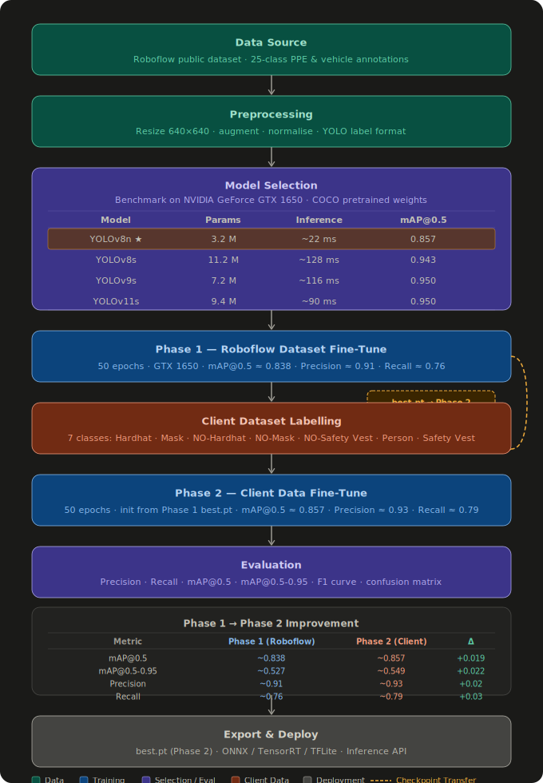

---

## Dataset

Training data combines a public Roboflow PPE dataset (Phase 1) with proprietary client imagery (Phase 2). All images are resized to **640×640** pixels with YOLO-format annotations.

### Class Distribution


| Class | Train Instances | Notes |
|---|---|---|
| Person | 9,691 | Dominant class (~37% of all annotations) |
| NO-Safety Vest | 3,957 | Most common violation |
| Hardhat | 3,362 | Core positive PPE class |
| NO-Mask | 3,209 | Violation class |
| Safety Vest | 3,170 | Positive PPE class |
| NO-Hardhat | 2,318 | Fewer examples — hardest class |
| Mask | 1,743 | Smallest class — consider augmentation |

> **Note:** The bounding-box distribution (top-right) shows objects span a wide range of image positions and scales. The width/height scatter (bottom-right) confirms most PPE items are small-to-medium relative to frame size.

---

## Model Selection

Four YOLO variants were benchmarked on the **NVIDIA GeForce GTX 1650** across parameter count, inference latency, and mAP@0.5. YOLOv8n was selected for its 5× speed advantage over YOLOv8s with an acceptable accuracy trade-off.

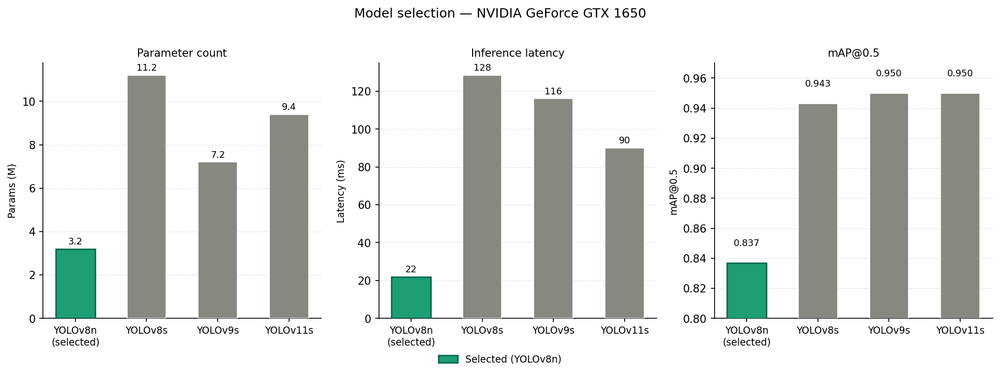

| Model | Params (M) | Latency (ms) | mAP@0.5 | Selected |
|---|---|---|---|---|
| **YOLOv8n** | **3.2** | **22** | 0.837 | ✅ |
| YOLOv8s | 11.2 | 128 | 0.943 | — |
| YOLOv9s | 7.2 | 116 | 0.950 | — |
| YOLOv11s | 9.4 | 90 | 0.950 | — |

---

## Training

### Hyperparameters

| Parameter | Value | Parameter | Value |
|---|---|---|---|
| Image size | 640×640 | Optimizer | SGD |
| Batch size | 16 | Initial LR | 0.00088 |
| Epochs (per phase) | 50 | LR schedule | Cosine decay |
| Warmup epochs | 3 | Momentum | 0.937 |
| Weight decay | 0.0005 | IOU threshold | 0.7 |

---

### Phase 1 — Roboflow Pre-Training

Phase 1 trains from the COCO-pretrained YOLOv8n backbone on the full Roboflow PPE dataset. This establishes task-specific feature representations before domain adaptation.

#### Loss Curves

All three YOLO loss components (box localisation, classification, DFL) converge smoothly across 50 epochs with no instability.

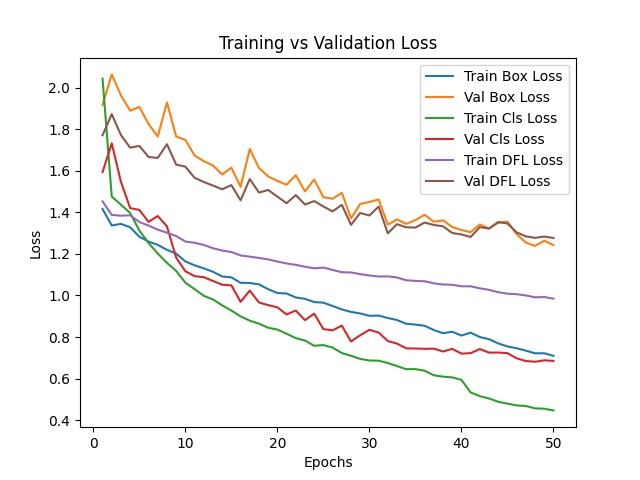

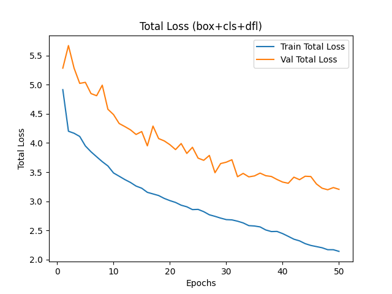

#### Learning Rate Schedule

Linear warmup for 3 epochs → cosine decay to near-zero by epoch 50.

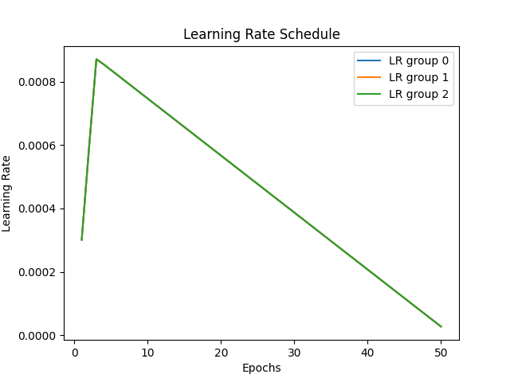

#### mAP Performance

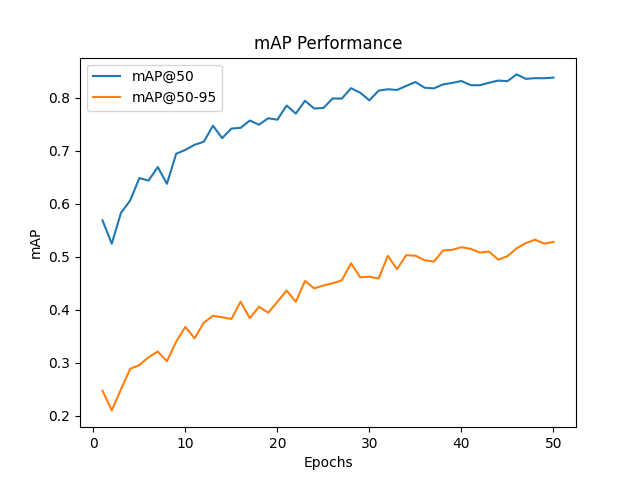

The gap between mAP@0.5 and mAP@0.5-0.95 narrows from ~0.37 → ~0.31 over training, indicating improving bounding-box localisation quality.

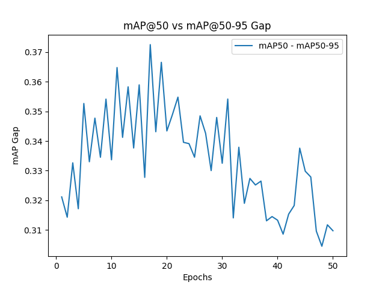

#### Precision & Recall

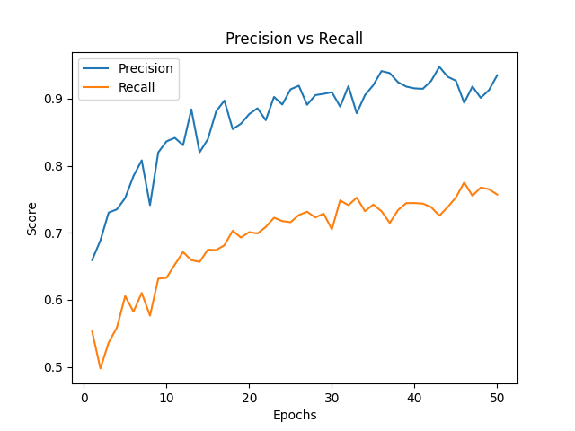

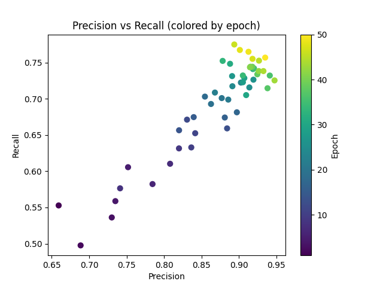

*Scatter plot coloured by epoch — the trajectory moves toward high precision and high recall over training.*

#### F1 Score

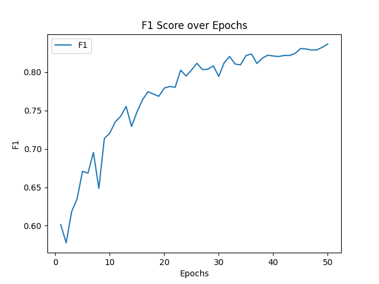

---

### Phase 2 — Client Data Fine-Tuning

Phase 2 loads the **Phase 1 best checkpoint** (`runs/phase1/weights/best.pt`) and fine-tunes on client-specific imagery, adapting the model to the target deployment environment. Because we start from the Phase 1 best weights rather than random initialisation, the model already understands PPE classes — Phase 2 only needs to close the domain gap.

**Phase 1 vs Phase 2 comparison:**

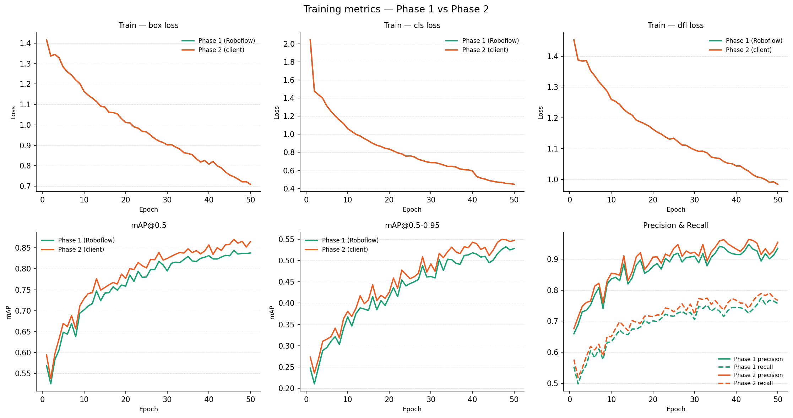

| Metric | Phase 1 (Roboflow) | Phase 2 (Client) | Δ |
|---|---|---|---|
| mAP@0.5 (epoch 50) | ~0.838 | **~0.857** | **+0.019** |
| mAP@0.5-0.95 (epoch 50) | ~0.527 | **~0.549** | **+0.022** |
| Precision (epoch 50) | ~0.91 | **~0.93** | **+0.02** |
| Recall (epoch 50) | ~0.76 | **~0.79** | **+0.03** |

> Phase 2 consistently improves every metric over Phase 1, confirming that fine-tuning on client-specific imagery provides meaningful domain adaptation gains without sacrificing the generalisability learned in Phase 1.

---

## Results

All evaluation metrics below are from the **Phase 2 final checkpoint** (`runs/phase2/weights/best.pt`) — the best model produced by the two-phase curriculum.

### Final Evaluation

Full training dashboard showing all losses and metrics over 50 epochs:


#### F1-Confidence Curve

Optimal confidence threshold: **0.380** → F1 = **0.83**


#### Precision-Confidence Curve

All classes reach precision **1.00** at confidence **0.938**.


#### Recall-Confidence Curve

All classes recall **0.86** at confidence **0.000**.


#### Precision-Recall Curve


| Class | AP@0.5 |
|---|---|
| Safety Vest | **0.935** |
| Mask | 0.914 |
| Person | 0.862 |
| Hardhat | 0.851 |
| NO-Safety Vest | 0.813 |
| NO-Mask | 0.758 |
| NO-Hardhat | 0.726 |
| **All classes** | **0.837** |

---

### Per-Class Metrics

Precision, Recall, and F1-Score per class at the optimal confidence threshold (0.380):


---

### Confusion Matrix

#### Raw Counts


#### Normalised (per true class = recall)


| Class | Recall | Primary Error |
|---|---|---|
| Mask | 0.90 | 1% → background |
| Safety Vest | 0.89 | 11% → background |
| Person | 0.81 | 17% → background (occlusion) |
| Hardhat | 0.78 | 13% → background, 3% → NO-Hardhat |
| NO-Mask | 0.76 | 18% → background |
| NO-Safety Vest | 0.71 | 17% → background |
| NO-Hardhat | **0.67** | **30% → background** (hardest class) |

> **Key insight:** The dominant failure mode is **background confusion** (missed detections), not class confusion. Objects are being missed rather than mis-labelled. This is best addressed by adding more training data and enabling mosaic/copy-paste augmentation.

---

## Installation

### Prerequisites

- Python ≥ 3.9
- CUDA 11.8+ (for GPU training)
- 4 GB VRAM minimum (GTX 1650 or equivalent)

### Setup

```bash
git clone https://github.com/your-org/ppe-detection.git
cd ppe-detection
pip install -r requirements.txt
```

### `requirements.txt`

```
ultralytics>=8.0.0
torch>=2.0.0
torchvision>=0.15.0
opencv-python>=4.8.0
numpy>=1.24.0
matplotlib>=3.7.0
pandas>=2.0.0
Pillow>=10.0.0
roboflow>=1.1.0
```

---

## Quick Start

### Run Inference on an Image

```python
from ultralytics import YOLO

model = YOLO("runs/phase2/weights/best.pt")

results = model.predict(
    source="image.jpg",
    conf=0.38,       # optimal F1 threshold
    iou=0.45,
    imgsz=640,
    save=True
)
results[0].show()
```

### Run on a Video Stream

```python
results = model.predict(
    source="rtsp://camera-ip:554/stream",  # or path to .mp4
    conf=0.38,
    stream=True
)

for r in results:
    frame = r.plot()   # annotated frame
    cv2.imshow("PPE Detection", frame)
```

### Train Phase 1

```bash
python train_phase1.py \
  --data data/roboflow/data.yaml \
  --model yolov8n.pt \
  --epochs 50 \
  --imgsz 640 \
  --batch 16
```

### Train Phase 2 (Fine-Tune from Phase 1 Checkpoint)

```bash
python train_phase2.py \
  --data data/client/data.yaml \
  --weights runs/phase1/weights/best.pt \
  --epochs 50 \
  --imgsz 640 \
  --batch 16
```

---

## Inference & Deployment

### Recommended Confidence Thresholds

| Use Case | Confidence | IOU | Rationale |
|---|---|---|---|
| Real-time safety alert | **0.38** | 0.45 | Optimal F1 — balanced precision/recall |
| High-precision audit log | 0.60 | 0.50 | Fewer false alarms |
| High-recall compliance | 0.25 | 0.40 | Catch all violations, accept more FP |

### Export Formats

```python
from ultralytics import YOLO

model = YOLO("runs/phase2/weights/best.pt")

model.export(format="onnx")      # Cross-platform — recommended default
model.export(format="engine")    # TensorRT — 2-3× faster on NVIDIA hardware
model.export(format="tflite")    # TensorFlow Lite — mobile/edge
model.export(format="coreml")    # Apple devices
```

### Class Labels (`data.yaml`)

```yaml
names:
  0: Hardhat
  1: Mask
  2: NO-Hardhat
  3: NO-Mask
  4: NO-Safety Vest
  5: Person
  6: Safety Vest

nc: 7
```

---

## Repository Structure

```
ppe-detection/
├── data/
│   ├── roboflow/              # Phase 1 dataset (Roboflow export)
│   │   ├── train/
│   │   ├── valid/
│   │   ├── test/
│   │   └── data.yaml
│   ├── client/                # Phase 2 client-specific images
│   │   ├── train/
│   │   ├── valid/
│   │   └── data.yaml
├── runs/
│   ├── phase1/
│   │   └── weights/
│   │       ├── best.pt
│   │       └── last.pt
│   └── phase2/
│       └── weights/
│           ├── best.pt        ← use this for inference
│           └── last.pt
├── plots/                     # All diagnostic plots
│   ├── model_comparison.png
│   ├── training_curves.png
│   ├── results.png
│   ├── BoxF1_curve.png
│   ├── BoxPR_curve.png
│   ├── confusion_matrix.png
│   └── ...
├── train_phase1.py
├── train_phase2.py
├── predict.py
├── evaluate.py
├── requirements.txt
└── README.md
```

---

## Limitations & Future Work

### Current Limitations

- **Background confusion** is the primary failure mode (15–30% of objects missed, not mis-classified)
- **NO-Hardhat recall = 0.67** — hardest class, needs more annotated examples
- **Mask underrepresented** (1,743 instances) — may limit generalisation across diverse mask styles
- **Validation loss gap** (~3.2 val vs ~2.1 train at epoch 50) suggests mild overfitting
- Single-GPU training on GTX 1650 limits batch size and speed

### Roadmap

- [ ] Collect 500–1,000 additional NO-Hardhat and Mask images
- [ ] Enable mosaic + copy-paste augmentation for better small-object detection
- [ ] Upgrade to YOLOv8s if deployment latency budget allows (>100 ms)
- [ ] Export to TensorRT engine for 2–3× speedup on NVIDIA edge devices
- [ ] Integrate ByteTrack / BoT-SORT for temporal consistency in video
- [ ] Active learning loop: feed deployment hard negatives back into training
- [ ] Add confidence calibration for reliable probability estimates

---

## License

This project is licensed under the MIT License — see [LICENSE](LICENSE) for details.

---

<div align="center">
<sub>YOLOv8n · Two-Phase Training · GTX 1650 · Phase 2 mAP@0.5 0.857</sub>
</div>
